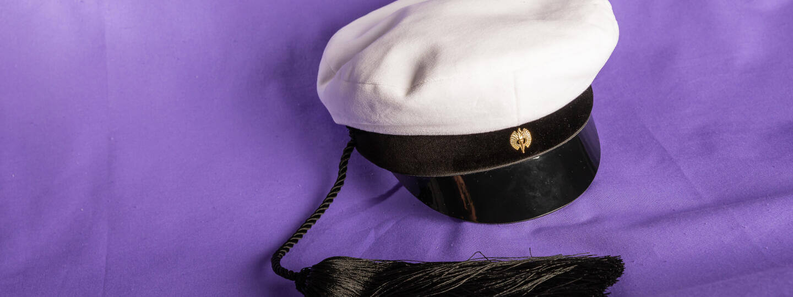

## Teekkari Cap

### Rules

Rules are available only in Finnish and Swedish.

### History

The Teekkari Cap of Turku was used for the first time in 1960 by Kemistklubben. The idea of a teekkari cap in Turku came up already in the 1940s. The idea was not popular because tassels were a sign of a graduate person.

Originally it was one of the cap models in Helsinki University of Technology that was used in Turku. Later the cockade of the Student Union of Åbo Akademi University was started to connect to the cap. The teekkari cap of Kemistklubben was protected in the 1990s.

The teekkari guilds of the University of Turku started  to use the same teekkari cap model with few differences. The lining has different colours and patterns. The cockade in use is the cockade of the Student Union of the University of Turku.

Teekkarikomissio took over the trademark of Turkus teekkari cap in the 2020s.

References

Nordell Ida 2023: Kemistklubben vid Åbo Akademi rf 1923-2023 : hundra år med Axel och Stina, Turku
