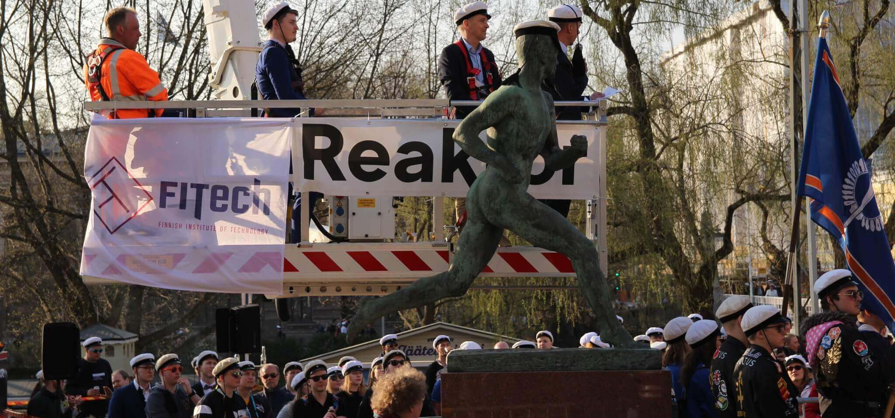

## For companies

Teekkarikomissio aims to build long lasting collaborations with many kinds of companies. Teekkarikomissio can offer wide visibility among engineering students at the University of Turku and Åbo Akademi University. The visibility is equally important to the students as it is to companies, since students are always looking for career opportunities. Identifying the name and logo of a company is a big step, but building a positive image is also possible via us.

We are able to offer visibility for example at:

- Social media platforms
- Web page
- Events
    - Teekkari Cap Ceremony
    - Paavo Nurmi Cap Ceremony
    - Teekkari Dipping
    - TeekkariExpo

- Board’s representation overall

The best visibility can be reached at our big events near May Day. These Wappu events (Teekkari Cap Ceremony, Paavo Nurmi Cap Ceremony, and Teekkari Dipping) are the best place for your company to gain visibility among students, as well as bypassers. Being arranged every autumn, TeekkariExpo is an excellent chance to meet students and recruit. One of our strengths is an open mind and flexibility, so feel free to propose even new ideas!

Don’t hesitate to contact!

Annastiina Manninen

Commissioner of Foreign Affairs 2025

annastiina.manninen(at)teekkarikomissio.fi
